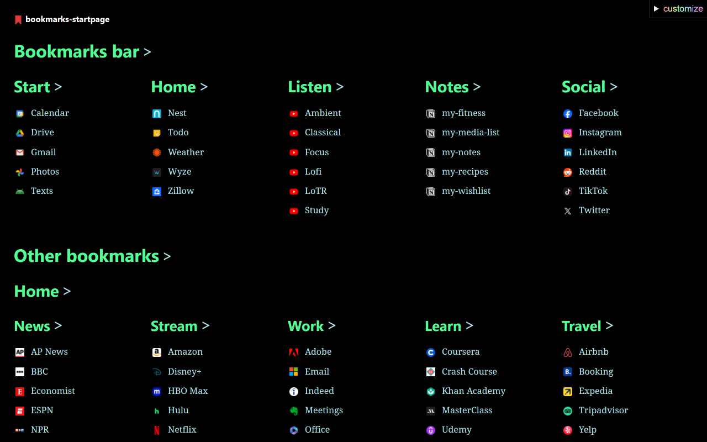

# 🔖 bookmarks-startpage

A browser extension that displays your bookmarks on simple, customizable pages. View the [**Bookmarks Startpage** extension in the Chrome Web Store](https://chromewebstore.google.com/detail/bookmarks-startpage/nkbcfcjndkpjejdfekeemdelppjdmlga).

## Todo

- Add demo page, landing page
- Workaround for missing favicons
- Look into [Featured badge](https://www.extension.ninja/blog/post/how-to-get-featured-extension-badge-chrome-web-store/)
- Publish for Firefox (test)

### Later

- For testing: `chrome.storage.sync.clear()`
- Test multiple sections issue w/ uneven bookmark nesting
- Add option for masonry layout
