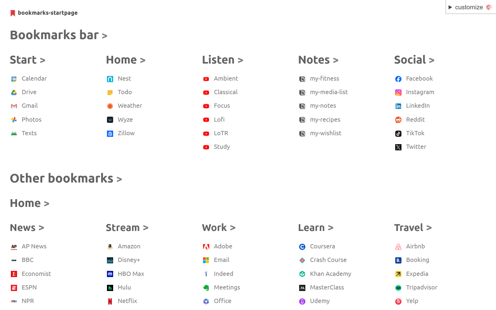

# 🔖 bookmarks-startpage

A browser extension that displays your bookmarks on simple, customizable pages. View the [**Bookmarks Startpage** extension in the Chrome Web Store](https://chromewebstore.google.com/detail/bookmarks-startpage/nkbcfcjndkpjejdfekeemdelppjdmlga).

## Todo

- **Firefox version (test)**
- Update for [changes to Bookmarks API](https://developer.chrome.com/blog/bookmarks-sync-changes)?

### Later

- For testing: `chrome.storage.sync.clear()`
- Test multiple sections issue w/ uneven bookmark nesting
